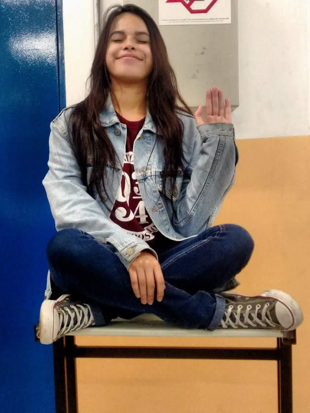

### Camila Correia - Analista de Testes Jr.

  
  
   

 

  

Oi, meu nome é Camila Correia e sou a nova garota de programa(brincadeira kkk) Para, a estagiária que compra café, mas para pessoas normais, a Novata. Sou a pessoa mais aleatória e aventureira que você irá conhecer e posso dizer que no auge dos meus 20 aninhos tenho um nível de experiência de um dos personagens de Se beber não case(mesmo nível de amigos doidos e aletórios)

PS: Sou apaixonada por gatos, manda foto do seu miau ai.

## Minhas Paixões | My Passions

- Música | Music :headphones: 
- Programação | Programming :computer:
- Livros | Books :books:
- Estudar | To study :open_book:
- Café | Coffee :coffee:
- Halloween :jack_o_lantern:

#    
 

